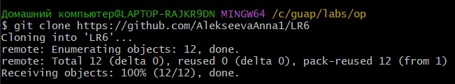
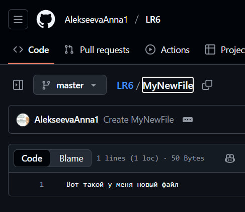
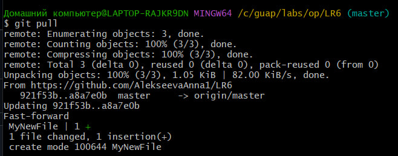
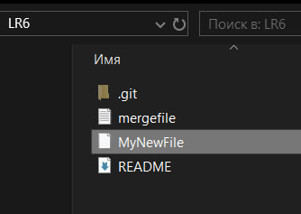
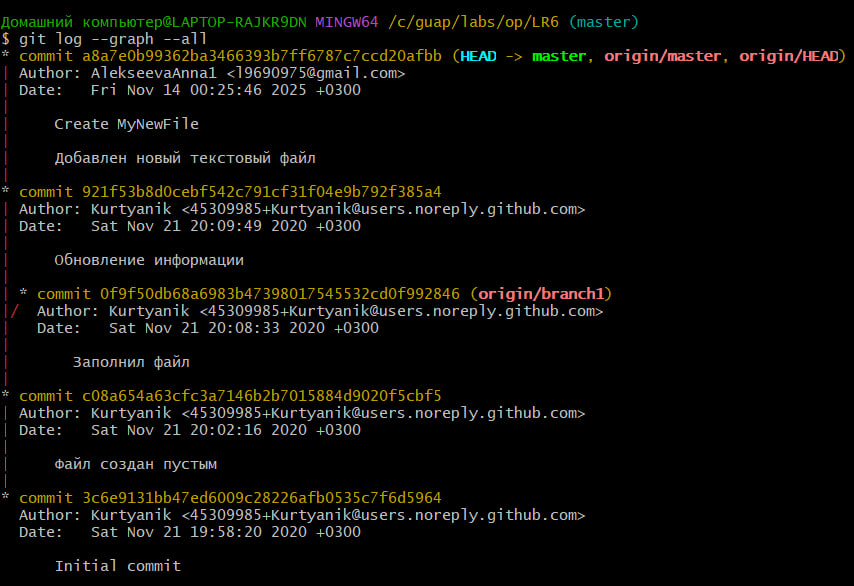
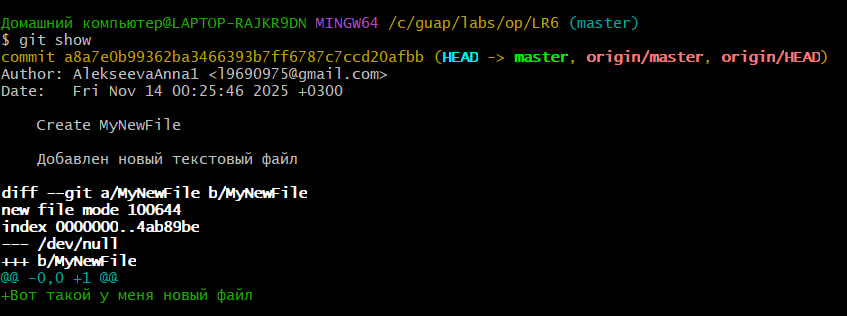
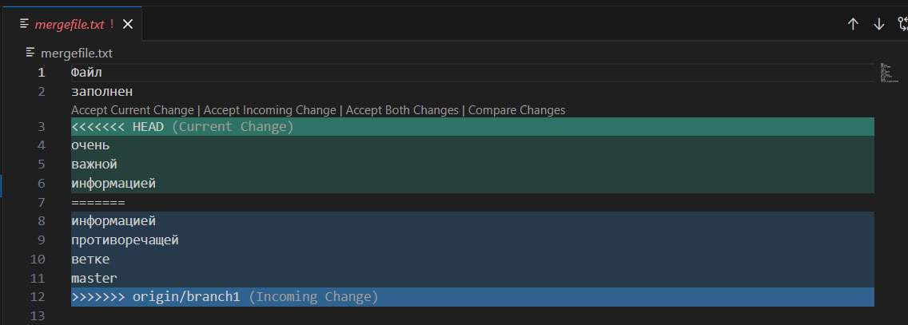
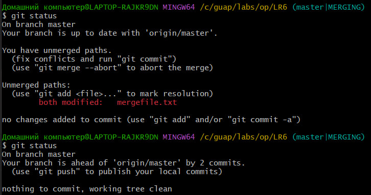
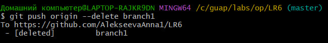

# Лабораторная работа №6
## Система контроля версий

### Цель работы
Изучение базовых возможностей системы
управления версиями, опыт работы с Git Api, опыт работы с локальным и
удаленным репозиторием. 

## Порядок выполнения работы:
1. Создать аккаунт на сайте GitHub. 
2. Сделать копию в личное хранилище из
https://github.com/Kurtyanik/LR6/ (Fork). 
3. Установить Git (https://git-scm.com/). 
4. После установки настроить клиент git, введя имя пользователя (Группа
Фамилия И.О.) и email. 
5. Клонировать свой личный удалённый репозиторий на компьютер. 
6. Добавить файл через интерфейс GitHub. Подтянуть изменения в
локальный репозиторий. 
Далее локально:
7. Получить историю операций для каждой из веток. 
8. Просмотреть последние изменения. 
9. Выполнить слияние в ветку master, разрешив конфликт (можно
использовать специальные редакторы или графический интерфейс git). 
10. Удалить побочную ветку после успешного слияния. 
11. Сделать изменения и зафиксировать их, оставляя комментарии,
несколько раз. 
12. Сделать откат коммита. 
13. Создать ветку для отчёта. 
14. Начать оформлять отчёт в файле README.md (разрешены сторонние
редакторы с подсветкой синтаксиса), используя markdown синтаксис
(https://guides.github.com/features/mastering-markdown/)

## Ход выполнения работы

### 1. Создание копии (fork) в личный репозитории
Важно снять галочку "Copy the master branch only", чтобы в дальнейшем возник запланированный конфликт.

### 2. Клонирование удалённого репозитория на компьютер
 В терминале выполняется команда git clone "ссылка на удалённый репозиторий"

### 3. Добавление нового файла через интерфейс GitHub
 В удалённом репозитории создаётся новый текстовый файл. 

Чтобы он появился в локальном репозитории, необходимо выполнить `git pull`.

Теперь локальный репозиторий имеет вид:

### 3. Получение истории операций для каждой из веток

### 4. Просмотр последних изменений

### 5. Слияние веток master и branch1, решение конфликта

Команда git fetch origin позволяет получить информацию обо всех удалённых ветках, в данном случае на branch1. 
Команда git merge origin/branch1`сливает изменения из удаленной ветки в текущую локальную (`master). \
При этом возникает конфликт в связи с разным содержимым файла mergefile.txt в ветках. 

Для решения конфликта в VS Code вручную удаляем лишние строки (не важные):

Побочная ветка удаляется:

Изменения добаваляются в индекс, создается коммит с комментарием

